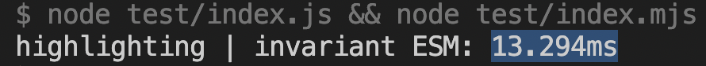
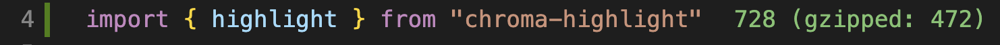
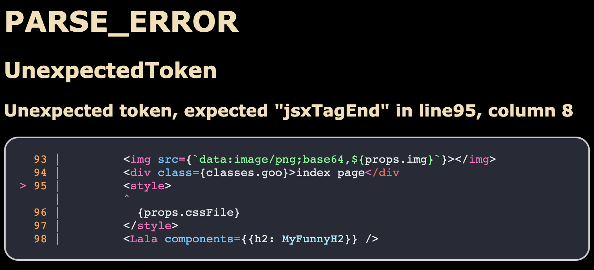

# chroma-highlight

This package makes [`chroma`](https://github.com/alecthomas/chroma), a general purpose syntax highlighter in pure Go, available for Node.js.

Automatically downloads the correct binary for the target platform.

The current binary version of `chroma` used is the latest, released in Nov 2022, `v2.4.0`.

## How to install
```bash
npm install chroma-highlight
# or
yarn add chroma-highlight
```

### Integration in your codebase

## Usage

```ts
import { highlight } from "chroma-highlight"

// simply pass all the CLI arguments that you'd pass to the `chroma` binary
const formattedSyntaxAsHTML = highlight(`
  93 |         </img>
  94 |         <div class={classes.goo}>index page</div
> 95 |         <style>
     |         ^
  96 |           {props.cssFile}
  97 |         </style>
  98 |         <MDXFun components={{h2: CustomH2}} />
`, `--formatter html --html-only --html-inline-styles --lexer typescript --style base16-snazzy`)
```

### CommonJS

```ts
const { highlight } = require("chroma-highlight")
```

### Speed

This library formats a snippet like the above in around `~13ms` all-in.
Most of the time is spent for the executable invocation and wrapping layer.



### Size

The pure JS library size (without the binary that is never bundled-in) is around `~470 byte` gzipped.



### Capabilities

In contrst to all JavaScript based highlighting libraries, `chroma` is able to
format and style a vertical mixed-mode snippet like the above correctly and deal with
incorrect syntax such as non-closed tags intelligently. Thus, it's perfectly suited for
highlighting syntax error reports and such.




